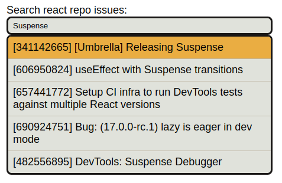

# Avantica NuOrder coding challenge

A simple typeahead input that searches issues in React's GitHub repo.

## Setup

~~~bash
yarn install
yarn start # spins up a server at http://localhost:8080
~~~

## Run test

~~~bash
yarn test
~~~
